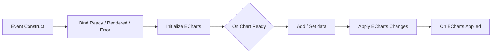
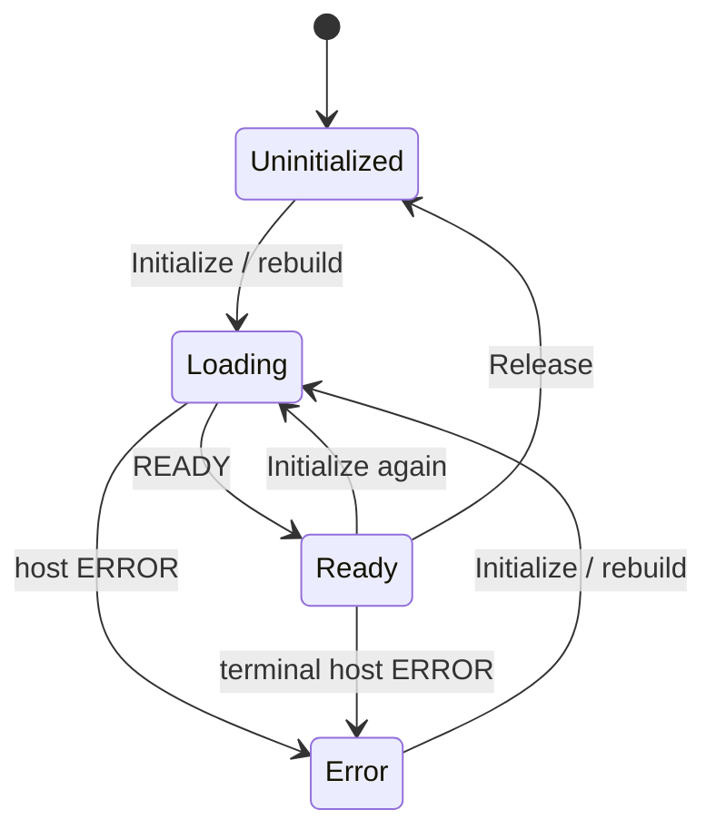

# ECharts Widget 1.0.0

[English quick reference](README_EN.md)

ECharts Widget 是面向 **Unreal Engine 5.6 / Win64** 的离线 UMG 图表插件。它把 Apache ECharts 6.1.0 与 echarts-gl 2.1.0 打包进插件，通过 UE 的 `WebBrowserWidget`/CEF 在 `ECharts Widget` 控件中渲染 2D、3D、DataTable 快照和有界时序流。宿主页、模板和第三方 JavaScript 都从插件自身的 `Resources/Web` 加载，无 CDN、npm 或运行时网络依赖。

> [!IMPORTANT]
> `EChartsWidget` 是全新的独立插件，不是旧 `ChartWidget` 的原位升级。两者部分 Blueprint 节点命名可能相似，但模块、目录、控件类和数据模型均不同。它们可以在同一项目中并存；本插件不修改旧 `ChartWidget`，也不承诺旧蓝图替换控件后直接兼容。

## 1. 功能与支持范围

| 项目 | 说明 |
| --- | --- |
| 插件版本 | 1.0.0 |
| 引擎/平台 | Unreal Engine 5.6 / Win64 |
| UI 基类 | `UEChartsWidget : UWebBrowser`；UMG Palette 中显示为 `ECharts Widget` |
| 运行时 | UE `WebBrowserWidget` / CEF |
| 图表库 | Apache ECharts 6.1.0、echarts-gl 2.1.0 |
| 内置模板 | `SegmentedAreaLine`、`Bar3DHeightMap`、`DataTableScatter3D`、`CustomOption` |
| 数据入口 | Blueprint 数值/分类/3D、DataTable 快照、DataTable 时序流、Option JSON、可信 Raw JavaScript |
| 硬限制 | 4 个系列（0–3）、总计 100000 点、数据/Option JSON 16 MiB、Raw JavaScript 1 MiB |

插件没有历史数据库、磁盘回放或 `Set History Capacity`。`Set 2D Point Window` 与 Time Series 都只保留内存中的当前窗口；长期历史应由游戏自己的数据层保存。

## 2. 安装、替换与打包

### 2.1 新安装

1. 关闭 Unreal Editor。
2. 在项目根目录创建 `Plugins`（若不存在）。
3. 只复制完整的 `EChartsWidget` 文件夹到：

   ```text
   <YourProject>/Plugins/EChartsWidget/
   ├─ EChartsWidget.uplugin
   ├─ Source/
   ├─ Resources/Web/
   ├─ ThirdPartyLicenses/
   └─ ...
   ```

4. 不要把它复制成 `<YourProject>/Plugins/ChartWidget`，也不要覆盖或删除已有的旧 `ChartWidget`。两个插件可以并存。
5. 打开项目，在 **Edit > Plugins > UI** 中确认 **ECharts Widget** 已启用。描述符默认启用它，并声明依赖 **Web Browser Widget**；若编辑器要求启用依赖或重启，请接受并重启项目。
6. 在 UMG Designer 的 **ECharts** 分类中确认能看到 `ECharts Widget`。

### 2.2 替换旧版 EChartsWidget

关闭编辑器后，先备份现有 `<YourProject>/Plugins/EChartsWidget`，再用新版本的**整个同名文件夹**替换它。不要逐文件叠加，否则旧的 `Binaries`、`Intermediate` 或 Web 资源可能残留。此处只替换 `EChartsWidget`，不要覆盖独立的 `ChartWidget`。

若更新后提示二进制版本不匹配，可在编辑器关闭时删除 **EChartsWidget 插件自身**的 `Binaries` 和 `Intermediate`，再重新编译。不要删除项目的 `Content`、`Config`、`Saved/SaveGames` 或其他用户数据。

### 2.3 源代码项目首次编译

本仓库发布源码插件。C++ 项目可让 UE 首次打开时编译，或重新生成 IDE 工程后构建 `Development Editor | Win64`。纯 Blueprint 项目若没有匹配的预编译二进制，也需要安装 UE 5.6 对应的 Visual Studio C++ 工具链。编译后重启项目，确保模块和 UMG Palette 都来自新版本。

### 2.4 Shipping 与 NonUFS

`EChartsWidget.Build.cs` 将以下文件注册为 **NonUFS** Runtime Dependency：

- `Resources/Web/**`
- `ThirdPartyLicenses/**`
- `LICENSE`
- `THIRD_PARTY_NOTICES.md`

正常使用 Package Project 或 `BuildCookRun` 即可；不要把资源手工塞入 `Content` 或改成 CDN。打包后应在 staged 插件目录中找到 `chart-host.html`、`chart-host.js`、`templates.js` 和两个 vendor bundle。若缺失，先检查 staging/插件过滤规则。

## 3. 5 分钟上手

### 3.1 UMG 控件

1. 新建 Widget Blueprint，例如 `WBP_ChartDemo`。
2. 从 Palette 的 **ECharts** 分类拖入 `ECharts Widget`，勾选 **Is Variable**，命名如 `Chart`。
3. 给控件明确的非零尺寸。全屏时将 Anchors 四边拉伸并把 offsets 设为 0；嵌入面板时给父容器或控件宽高。CEF 页面是 100% 宽高，父级为 0 会显示空白。

### 3.2 Construct 顺序

先绑定事件，再初始化：



`Initialize ECharts` 参数：

- `Template`：默认 `SegmentedAreaLine`。
- `In Interaction Mode`：默认 `ClickOnly`。

推荐观察：

- `On Chart Ready`：当前本地宿主页已就绪，可执行 Raw JS；每世代最多一次。
- `On Chart Rendered(Requested Template, Effective Template)`：模板已被 ECharts 接受；3D 回退时两者不同。
- `On ECharts Warning`：例如 WebGL 不可用。
- `On ECharts Error`：数据校验或宿主错误；结合 `Runtime State` 判断是否终止。

### 3.3 数据与 Apply

```text
On Chart Ready
  → Set Series Name(0, "Temperature")
  → Set Legend Settings(Position=Auto, Orientation=Auto, FontSize=12)
  → Add Data Point(0, 0.0, 21.5)
  → Add Data Point(0, 1.0, 22.1)
  → Add Data Point(0, 2.0, 23.0)
  → Apply ECharts Changes
```

数据节点只更新 UE 侧缓存。两种提交方式：

- **手动 Apply**：每批修改后调用 `Apply ECharts Changes`。
- **Auto Apply**：`Set Auto Apply Enabled(true, Hz)`；`Hz` 夹紧到 **1–30 Hz**，默认 10 Hz。它合并修改，并等待上一笔浏览器 ACK，避免无限堆积。
- 图例数量不手填：它始终等于当前有数据的非空系列数；`Set Series Name` 只修改对应图例名称。`Set Legend Settings` 可覆盖显示、位置、方向、间距、字号和图标尺寸，`Reset Legend Settings` 恢复响应式默认值。

## 4. 模板与 WebGL 回退

| 模板 | 用途 | WebGL 不可用时 |
| --- | --- | --- |
| `SegmentedAreaLine` | 2D 折线、面积、分段区域 | 保持 2D |
| `Bar3DHeightMap` | XYZ 高度柱/高度图 | `Bar3DHeightMap2D` heatmap |
| `DataTableScatter3D` | 3D 散点 | `DataTableScatter2D` scatter |
| `CustomOption` | 自定义 ECharts option | 取决于用户 option；不会自动改写任意自定义 3D option |

3D 点为 `[X, Y, Z, ColorValue, SymbolSizeValue]`。原生 Bar3D/Scatter3D 用 `ColorValue` 自动计算 visualMap 色域、用 `SymbolSizeValue` 控制散点大小；纯原生 3D option 不包含 2D `xAxis/yAxis/grid`。`Bar3DHeightMap` 使用数值型 3D 轴；回退 heatmap 会把任意数值 X/Y 映射到稳定分类格点并以 Z 着色，Scatter2D 回退仍以 `ColorValue` 着色。Auto Apply 和普通 Apply 只合并数据/图例/色域，不重建 `grid3D`，因此保留用户当前视角。

回退会设置 `Last Warning`、广播 Warning，并在 `Effective Template` 记录实际名称。所有内置 3D 模板的 `grid3D.viewControl.autoRotate` 都为 `false`。

内置 Bar3D 无数据演示网格的宿主 `size` 安全范围为 1–128；公开 Blueprint 初始化节点没有 `size` 参数，正常使用应通过 3D 数据节点提供点。

## 5. Blueprint API 完整参考

所有写操作应从 Game Thread/普通 Blueprint 事件调用。系列索引只能是 **0–3**。同一系列一旦成为 Numeric 2D、Category 或 3D，`Add/Append` 不能混入另一类型；用对应 `Set` 替换，或先 `Clear Series`。

### 5.1 初始化与高级 API

| 节点（签名） | 返回与时机 |
| --- | --- |
| `Initialize ECharts(Template=SegmentedAreaLine, In Interaction Mode=ClickOnly)` | `void`；异步加载本地页并创建新世代，可从 Error 恢复。 |
| `Set Interaction Mode(Mode)` | `void`；Ready 时异步应用，未 Ready 时缓存。结果见 `On Interaction Mode Applied`。 |
| `Set ECharts Option JSON(Option Json)` | `bool`；接受顶层 object 且 UTF-8 ≤16 MiB。`true` 仅是本地预检通过，最终结果见 `On Option Applied`。 |
| `Execute ECharts JavaScript(JavaScript, Out Request Id)` | `bool`；仅 Ready，UTF-8 ≤1 MiB；成功入队返回正 Request ID，最终结果见 `On JavaScript Result`。不缓存/重放。 |

### 5.2 2D、Category、3D 数据

| 节点（均在 `ECharts|Data`） | 返回/说明 |
| --- | --- |
| `Add Data Point(Series Index, X, Y)` | `bool`；追加有限数值点。 |
| `Set Series Data(Series Index, FEChartsDataPoint2D[])` | `bool`；原子替换；元素为 `X, Y`；会停止活动流。 |
| `Append Series Data(Series Index, FEChartsDataPoint2D[])` | `bool`；原子追加。 |
| `Get Series Data(Series Index)` | `FEChartsDataPoint2D[]`；Pure；类型/索引错误返回空。 |
| `Add Category Data Point(Series Index, X:String, Y)` | `bool`；X 去除首尾空白后不得为空。 |
| `Set Category Series Data(Series Index, FEChartsCategoryDataPoint[])` | `bool`；原子替换；会停止活动流。 |
| `Append Category Series Data(Series Index, FEChartsCategoryDataPoint[])` | `bool`；原子追加。 |
| `Get Category Series Data(Series Index)` | `FEChartsCategoryDataPoint[]`；Pure。 |
| `Set 2D Point Window(Enabled, Max Points=1000)` | `void`；默认关闭；Max 夹紧 1–100000。对每个非 stream Numeric2D/Category 系列独立保留最新 N 点。 |
| `Reset 2D Point Window()` | `void`；恢复 Disabled/1000；已删除的旧点不会恢复。 |
| `Set 3D Data(Series Index, FEChartsDataPoint3D[])` | `bool`；原子替换；会停止活动流。 |
| `Append 3D Data(Series Index, FEChartsDataPoint3D[])` | `bool`；原子追加。 |
| `Get 3D Data(Series Index)` | `FEChartsDataPoint3D[]`；Pure。 |

`FEChartsDataPoint3D` 字段是 `X/Y/Z/ColorValue/SymbolSizeValue`，五者均须有限。普通 Category Apply 建立各 Category 系列标签并集；同系列重复 X 最后一个值生效，缺失标签补 `null`。DataTable Time Series 则保留重复标签位置。

二维点数窗口使用固定容量真环：开启或缩小时立即对 Series 0–3 的 Numeric2D/Category 各自取最后 N 点；后续 Add/Append 稳定覆盖最早点，Set/DataTable snapshot 在排序、安装后取 suffix，Get 保持逻辑顺序。删除不可恢复；Disable/Reset 只解除上限，保留当前点并允许后续增长。它不安装 `dataZoom`，不监听鼠标拖动/滚轮；payload 只提交当前缓存，value/category 轴随窗口自动重算。

`Data3D` 完全不受该节点影响：不会裁剪、转换或改变 `X/Y/Z/ColorValue/SymbolSizeValue`，仍严格遵守全局 100000 点限制。DataTable Time Series 的 Series 0 在 Preparing/Playing/Paused 期间由现有 `Time Series Window` **独占控制**，不与二维点数窗口取 min；Series 1–3 的普通二维数据仍受二维窗口控制。流 Stop/Completed 后，Series 0 再恢复普通二维窗口策略并提交最终 full payload。

Blueprint 示例：`Set 2D Point Window(true, 100)` → `Set Auto Apply Enabled(true, 10)` → timer 中持续 `Add Data Point(0, Elapsed, FPS)`。

### 5.3 系列、坐标轴与提交

| 节点 | 返回/说明 |
| --- | --- |
| `Clear Series(Series Index)` | `bool`；清空为 Unset，并停止流。 |
| `Clear All()` | `void`；清空 0–3 并停止流。 |
| `Set Series Name(Series Index, Name)` | `bool`；默认名 `Series 1`…`Series 4`。 |
| `Set X Axis Mode(Mode)` | `void`；默认 `ShowAll`；`Category` 分类轴；`FollowLatestWindow` 当前仍为数值轴标签，实际有界窗口由 Time Series 控制。 |
| `Apply ECharts Changes()` | `void`；提交最新 dirty revision；未 Ready 时延后，在途时等 ACK。 |
| `Set Auto Apply Enabled(Enabled, Max Updates Per Second=10.0)` | `void`；夹紧 1–30 Hz。 |

### 5.4 图例设置

`Set Legend Settings(Settings)` 与 `Reset Legend Settings()` 位于 `ECharts|Legend`。`FEChartsLegendSettings` 默认显示图例，位置/方向均为 Auto，字号 12、间距 10、图标 25×14、Custom X/Y 为 50%/5%；数值会按 Blueprint 元数据范围在 C++ 再次夹紧。Auto 在宽度 ≥720 CSS px 时顶部居中横排，窄窗口在右侧纵排；Top/Bottom/Left/Right/Custom 和 Horizontal/Vertical 可显式覆盖。设置采用事务语义：Blueprint Read Only 状态只在 `On Legend Settings Applied` 成功 ACK 后更新，失败保留 last-good；最新候选会在 Loading 与 Release/Rebuild 后重放，不使用 Tick 或轮询。即使 CustomOption 自带 legend object/array，Blueprint Legend Settings 仍是最终覆盖层。

无效索引、类型冲突、NaN/Infinity、空分类、总点数或 JSON 超限会返回 false/广播错误；批量 Set/Append 不会半写入。

### 5.5 DataTable API

| 节点 | 返回/说明 |
| --- | --- |
| `Get ECharts DataTable Columns(Table, Out Columns, Out Error)` | `bool`；发现顶层标量列，返回类型和 X/numeric 能力。 |
| `Set DataTable Mapping(Table, Mapping)` | `bool`；按当前模板预检，不扫描所有行；改变映射会停止当前流/加载。 |
| `Load Data Table(Rows Per Frame=256)` | `void`；预算夹紧 1–4096；分帧读取、worker 排序/转换/序列化，安装到 Series 0 并自动 Apply。 |
| `Cancel Data Table Load()` | `void`；取消 Reading/Processing/Applying，并尽可能恢复加载前 Series 0/轴。 |

### 5.6 Streaming API

| 节点 | 返回/说明 |
| --- | --- |
| `Set Time Series Enabled(Enabled)` | `void`；默认 false；false 会停止流。 |
| `Set Time Series Window(Max Visible Points)` | `void`；1–100000，默认 1000。 |
| `Start Data Table Streaming(Interval Seconds=0.1, Rows Per Step=1, Loop=false, Preparation Rows Per Frame=256)` | `bool`；须先启用并映射；参数夹紧 0.01–60、1–256、1–4096。 |
| `Pause Data Table Streaming()` | `void`；仅 Playing 有效。 |
| `Resume Data Table Streaming()` | `void`；仅 Paused 有效。 |
| `Stop Data Table Streaming()` | `void`；停止并释放准备缓存，保留显示窗口。 |

### 5.7 状态与事件

核心 Blueprint Read Only：`Current Template`、`Interaction Mode`、`Runtime State`、`Last Error`、`Last Warning`、`Effective Template`、`X Axis Mode`、`Is Dirty`、`Last Applied Revision/Point Count`、`Auto Apply Enabled/Max Updates Per Second`、`2D Point Window Enabled/Max 2D Point Window Points`。

DataTable 状态：`Idle / Reading / Processing / Applying / Completed / Error / Cancelled`，以及 `Rows Processed/Succeeded/Skipped/Total Rows`、`Last Data Table Error`。

Stream 状态：`Stopped / Preparing / Playing / Paused / Completed / Error`，以及 `Time Series Enabled/Window`、`Current Row`、`Loop Count`、`Streamed Rows`。

| 事件 | 参数/时机 |
| --- | --- |
| `On Chart Ready` | 当前世代 Ready，一次。 |
| `On Chart Rendered` | `Requested Template, Effective Template`；一次。 |
| `On ECharts Warning / Error` | `Message`；Error 也用于非终止数据校验，应查看 Runtime State。 |
| `On ECharts Applied` | `Revision, Point Count`；浏览器 ACK。 |
| `On Interaction Mode Applied` | `Mode, Success, Message`。 |
| `On Legend Settings Applied` | `Success, Message`；成功才提交 Blueprint Read Only 设置。 |
| `On Option Applied` | `Success, Message`。 |
| `On JavaScript Result` | `Request Id, Success, Message`。 |
| `On Data Table Load Progress` | `Processed, Total`。 |
| `On Data Table Loaded` | `Succeeded, Skipped`；精确 Apply ACK 后。 |
| `On Data Table Load Cancelled` | 活动加载取消。 |
| `On Data Table Streaming Started/Completed/Stopped` | 流生命周期。 |
| `On Data Table Stream Progress` | `Current, Total, Loop`。 |
| `On Data Table Stream Looped` | `Loop`。 |

## 6. DataTable 详细教程

### 6.1 支持列

| 顶层标量属性 | 分类 | 可作 2D X | 可作 Y/Z/Color/SymbolSize |
| --- | --- | --- | --- |
| 整数/浮点（无 enum 的 uint8、int、float、double 等） | Numeric | 是 | 是 |
| `FString`、`FName`、`FText` | Category | 是 | 否 |
| `UENUM` / enum byte | Category | 是 | 否 |
| 日期文本（String/Name/Text） | Category | 是，按文本 | 否 |
| bool、`FDateTime`、嵌套 struct、对象、数组/集合、固定数组 | Unsupported | 否 | 否 |

插件不解析日期。`"2026-09-21 10:30"` 只是 Category 标签，按大小写敏感词法顺序；真正时间轴请另存 Unix 秒、游戏秒等 numeric X。

### 6.2 Mapping 与 Order

`FEChartsDataTableMapping`：

- `X`：2D 必填 Numeric 或 Category；3D 必须 Numeric。
- `Y`：必填 Numeric。
- `Z`：3D 必填 Numeric。
- `Color`：可选 Numeric；3D 未映射时 `ColorValue=Z`。
- `SymbolSize`：可选 Numeric；未映射时 12。
- `Order`：`XAscending`（默认）或 `RowName`。

`XAscending` 稳定排序：numeric X 升序，Category 大小写敏感词法序；相同 key 保持读取顺序。`RowName` 按 FName plain name（忽略大小写）和 number 后缀排序，如 `Row_2` 可在 `Row_10` 前。

### 6.3 C++ 行示例

此 struct 放在游戏模块中，无需修改插件：

```cpp
#pragma once
#include "CoreMinimal.h"
#include "Engine/DataTable.h"
#include "TelemetryChartRow.generated.h"

UENUM(BlueprintType)
enum class ESensorBand : uint8 { Normal, Warning, Critical };

USTRUCT(BlueprintType)
struct FTelemetryChartRow : public FTableRowBase
{
    GENERATED_BODY()

    UPROPERTY(EditAnywhere, BlueprintReadWrite) FString TimestampText;
    UPROPERTY(EditAnywhere, BlueprintReadWrite) double X = 0.0;
    UPROPERTY(EditAnywhere, BlueprintReadWrite) double Y = 0.0;
    UPROPERTY(EditAnywhere, BlueprintReadWrite) double Z = 0.0;
    UPROPERTY(EditAnywhere, BlueprintReadWrite) float Color = 0.0f;
    UPROPERTY(EditAnywhere, BlueprintReadWrite) float PointSize = 12.0f;
    UPROPERTY(EditAnywhere, BlueprintReadWrite) FName Label;
    UPROPERTY(EditAnywhere, BlueprintReadWrite) ESensorBand Band = ESensorBand::Normal;
};
```

### 6.4 Blueprint 快照顺序

```text
Initialize ECharts(2D 或 3D 模板)
  → Get ECharts DataTable Columns(Table)
  → 检查 Columns / Out Error
  → Make FEChartsDataTableMapping
  → Set DataTable Mapping(Table, Mapping)
  → Load Data Table(256)
  → On Data Table Load Progress
  → On Data Table Loaded(Succeeded, Skipped)
```

空 Category、NaN/Infinity、缺失行或任一映射转换失败的行会跳过。`Processed = Succeeded + Skipped`。快照替换 Series 0、保留 Series 1–3，并设 `Category` 或 `ShowAll` 轴；即使 Auto Apply 关闭也会提交。Loaded 等浏览器 ACK，不只是 worker 完成。

## 7. Snapshot 与 Time Series

| 模式 | Snapshot | Time Series |
| --- | --- | --- |
| 入口 | `Load Data Table` | Enable + `Start Data Table Streaming` |
| 显示 | 排序后一次替换 Series 0 | 每 interval 追加 1–256 行 |
| 窗口 | 总点数/16 MiB 上限 | 真环 1–100000，默认 1000 |
| Loop | 无 | 不清空；回首行继续追加并淘汰最旧点 |
| 完成 | Apply ACK 后 | 非 Loop 的最终 revision ACK 后 |

精确边界：Window 1–100000；Interval 0.01–60 秒；RowsPerStep 1–256；PreparationRowsPerFrame 1–4096；源最多 100000 行，估算 JSON 最多 16 MiB。

启动进入 `Preparing`。排序 key 在 Game Thread 分帧读取，稳定排序在 worker，完整行继续分帧读取。第一批有效行准备好即可 Playing，**可早于整表准备完成**，不会为整表阻塞 Game Thread。

若源表处理完仍没有任何有效行，stream 最终进入 `Error`，错误信息为 `DataTable contains no valid rows to stream.`。

稳态发送小 delta（新增行+淘汰数），不每步重发完整窗口。未 ACK 时最多保留 **2 个 pending delta**，满后背压暂停，ACK 后恢复。Series 0 使用真环形缓存。Loop 到尾不清空，`Current Row` 回 0，首行继续追加；重复 Category 标签保留位置。

Pause 保留光标/窗口；Resume 继续；Stop 清理 ticker/准备源但保留显示。Slate/CEF Release 时准备/播放挂起；Rebuild 新建世代、恢复准备/播放并重放显示，旧世代消息被忽略。

一次性伪流程：

```text
Set Mapping → Enable(true) → Window(1000)
→ Start(0.1, 10, false, 256)
→ Preparing → Started/Playing → Progress
→ 源耗尽 → 等最终 Applied ACK → Completed
```

循环伪流程：

```text
Set Mapping → Enable(true) → Window(300)
→ Start(0.05, 4, true, 256)
→ 到尾 Looped(1)，Current Row=0，不清空 300 点
→ 首行继续追加，最旧点淘汰 → Pause/Resume/Stop
```

流只驱动 Series 0。已有不兼容类型会失败；先 Clear 或使用同类型。Set、Clear、改变映射或不兼容模板会停止流。

## 8. Interaction 三模式

默认 `ClickOnly`。

| 字段 | Disabled | ClickOnly | FullHover |
| --- | --- | --- | --- |
| tooltip show/triggerOn | false / none | true / click | true / mousemove\|click |
| legend.selectedMode | false | true | true |
| series.silent | true | false | false |
| 3D rotate | 0 | 1 | 1 |
| 3D zoom / pan | 0 / 0 | 0 / 0 | 1 / 1 |
| 3D autoRotate | false | false | false |

规则递归应用于根、`baseOption`、`options[]`、`media[].option` 的 tooltip/legend/series/grid3D。插件没有 UE 鼠标轮询或常驻交互 Tick；CEF/ECharts 自己处理输入。临时 CoreTicker 仅用于 DataTable、Auto Apply 和 stream。

> [!NOTE]
> 模式会覆盖这些字段，不是保存/恢复栈。CustomOption 原值在模式来回切换后不会自动恢复。需要自定义值时重新提交完整 Option，但当前模式仍会再次覆盖相关字段。

## 9. Option JSON 与 Raw JavaScript

### 9.1 Set ECharts Option JSON

- 必须是合法 JSON 顶层 object；数组、空文本和 UTF-8 超过 16 MiB 返回 false。
- JSON 不能有函数、注释、`undefined`、尾逗号、NaN/Infinity。
- 不要带 `option =`、`const option =` 或 `<script>`，参数就是 `{...}`。
- true 仅表示本地预检通过；ECharts 语义结果见 `On Option Applied`。
- 事务成功后成为 `CustomOption` 和 last-good。普通失败会重建健康 chart、恢复旧 option、保留 last-good，并保持 Ready。
- 若损坏实例连回滚/重建都失败，会发终止 Error；调用 Initialize 或让控件 Release/Rebuild 开新世代。
- last-good 与交互模式会在 Rebuild 后重放；Raw JS 不会。

把常见“1 号 segmented area JavaScript option”改成可直接传入的严格 JSON（无 `option =`、无函数）：

```json
{
  "animation": false,
  "backgroundColor": "transparent",
  "tooltip": { "trigger": "axis" },
  "legend": { "data": ["Value"] },
  "grid": { "left": 48, "right": 24, "top": 42, "bottom": 36 },
  "xAxis": {
    "type": "category",
    "boundaryGap": false,
    "data": ["00:00", "04:00", "08:00", "12:00", "16:00", "20:00", "24:00"]
  },
  "yAxis": { "type": "value" },
  "series": [{
    "name": "Value", "type": "line", "smooth": true, "symbolSize": 7,
    "data": [120, 176, 132, 248, 196, 286, 232],
    "lineStyle": { "width": 3 }, "areaStyle": { "opacity": 0.25 },
    "markArea": { "silent": true, "data": [
      [{ "name": "Low", "xAxis": "00:00", "itemStyle": { "color": "rgba(84,112,198,0.10)" } }, { "xAxis": "08:00" }],
      [{ "name": "Mid", "xAxis": "08:00" }, { "xAxis": "16:00" }],
      [{ "name": "High", "xAxis": "16:00" }, { "xAxis": "24:00" }]
    ]}
  }]
}
```

后续 Add/Set + Apply 会以此 CustomOption 为样式基线重建 series。Option 成功会停止活动 DataTable load/stream；失败会恢复它们。

### 9.2 Raw JS

仅对开发者完全信任的固定脚本使用。脚本接收 `chart`、`echarts`、`host`：

```javascript
if (!chart || !echarts || !host) throw new Error('Trusted APIs unavailable');
chart.setOption({ title: { text: 'Trusted local diagnostic' } });
host.resize();
```

节点返回 Request ID，用 `On JavaScript Result` 对应异步结果。异常通常只令本请求失败。

> [!CAUTION]
> **Raw JavaScript 是特权 API，不是沙箱。** 宿主通过 `new Function` 执行。`chart/echarts/host` 只是参数，不能隔离代码；脚本仍可访问 `window`、`globalThis`、`document`，篡改页面或导航。`connect-src 'none'` 限制 fetch/XHR/WebSocket 等连接，**不等于禁止导航**，也不是通用安全边界。
>
> 只执行经审查、编译进项目的开发者常量。绝不能传入或拼接玩家输入、网络响应、聊天、DataTable 单元格、配置、存档或任何不可信文本。插件没有绑定 UE UObject；不要自行增加 `window.ue`/UObject bridge。数据优先用类型化 API，样式优先用 Option JSON。

## 10. 性能、线程与限制

实现没有 Sleep、同步 CEF 等待或等待 JS 的阻塞循环，使用 revision + console marker ACK。Snapshot 与 Stream 的线程分工不同：

- **Snapshot**：UObject/反射读取在 Game Thread，受 `RowsPerFrame` 预算限制；worker 负责稳定排序、转换和完整 payload 构建，结果回 Game Thread 安装。
- **Stream**：worker **只**负责稳定排序行名；Game Thread 按 `PreparationRowsPerFrame` 分帧做反射读取和点转换，并为每步构建不超过 `RowsPerStep` 的小 delta。真环窗口和最多 2 个 pending delta 控制稳态成本。
- Stream 首批可早于完整准备显示，稳态不反复发送完整源表。
- Auto Apply 一次仅一笔在途，ACK 后提交最新 dirty 状态。
- 无 UE 鼠标轮询；宿主页使用 `ResizeObserver`。

| 硬限制 | 值 |
| --- | --- |
| Series / 总点数 | 4 / 100000 |
| 数据或 Option JSON | 16 MiB UTF-8 |
| Raw JS | 1 MiB UTF-8 |
| Stream 源/窗口 | 100000 行 / 1–100000 |
| Rows Per Step / pending delta | 1–256 / 最多 2 |
| Bar3D 演示网格 | 最大 128×128 |

建议：常规 HUD 用 1–10 Hz、窗口 200–2000；3D 优先 1–5 Hz 和小窗口；只在小数据并实测 Shipping CEF/GPU 足够时用 30 Hz。DataTable 卡顿就降低 RowsPerFrame。窗口接近 100000 时，即使 delta 小，浏览器重建 option 仍可能昂贵，请用 Unreal Insights/`stat unit` 实测。

## 11. 生命周期与恢复



1. 每次 Initialize 创建新 generation，旧 Ready/Rendered/Applied/Error 被忽略。
2. Ready/Rendered 每世代最多一次；数据可预先写入，Apply 会等 Ready。
3. 宿主 ERROR 对当前世代终止；Initialize 或 Release/Rebuild 清 LastError 并恢复。
4. 数据校验也广播 Error，但不一定令 Runtime State=Error。
5. Release 取消 ticker/在途请求；Rebuild 重放缓存数据、last-good Option、交互和可恢复 stream 意图。

常见顺序：Construct 绑定全部事件→Initialize；Ready 后 Set/Add→Apply，或提交 CustomOption；Raw JS 仅 Ready；离开页面可先 Stop stream/Cancel load，控件 Release/Destroy 也会清理。

## 12. 六个完整示例

### 12.1 实时 2D

Construct 初始化 `SegmentedAreaLine`；Ready 后 `Set Series Name(0,"FPS")`、`Set 2D Point Window(true,100)`、`Set Auto Apply Enabled(true,10)`；业务 timer 每 0.1 秒 `Add Data Point(0,Elapsed,FPS)`。缓存和画面始终只保留最新 100 点。

### 12.2 分类重复标签

```text
Set Category Series Data(0, [("A",1), ("A",9), ("B",2)])
Set X Axis Mode(Category) → Apply
```

普通结果为 A=9、B=2。若要保留 `A,B,A` 三个时间位置，使用 Category DataTable stream；保序窗口会保留重复位置。

### 12.3 3D scatter/bar

```text
Initialize(DataTableScatter3D, ClickOnly)
On Ready → Set 3D Data(0, [(1,2,3,3,10),(2,4,1,1,18)]) → Apply
          → Set Legend Settings(Position=Auto, Orientation=Auto, FontSize=12)
On Rendered → 检查 Effective Template 是否 DataTableScatter3D 或 DataTableScatter2D
```

改为 `Bar3DHeightMap` 得 bar3D；无 WebGL 时是 heatmap。

### 12.4 CustomOption

初始化 `CustomOption`；把第 9.1 节 JSON 作为 Blueprint String 常量传给 Set Option；bool false 是本地错误，`On Option Applied=false` 是异步语义错误。旧图会回滚；若 Runtime Error，重新 Initialize。之后仍可 Add/Set + Apply。

### 12.5 DataTable snapshot

```text
Initialize(SegmentedAreaLine)
→ Get Columns
→ Mapping(X="TimestampText",Y="Y",Order=XAscending)
→ Set Mapping → Load(256)
→ On Loaded 显示 Succeeded/Skipped
```

3D 则选择 3D 模板，X/Y/Z 都映射 numeric，Color/Size 可选。

### 12.6 Stream loop

```text
Initialize → Set Mapping
→ Time Series Enabled(true) → Window(300)
→ Start(0.05,4,true,256)
→ Progress / Looped → Pause / Resume / Stop
```

Loop 不清空，首行继续追加；`Streamed Rows` 是累计数，`Current Row` 是本 loop 位置，`Loop Count` 是回首次数。

## 13. Troubleshooting

| 问题 | 检查 |
| --- | --- |
| 空白 | 控件/父级非零尺寸；已 Initialize；收到 Ready/Rendered；查看 Runtime/LastError；资源完整。 |
| CEF/WebBrowser | 启用 Web Browser Widget 并重启；仅 UE5.6 Win64；检查 `Resources/Web`；真实 CEF 测试不要用 NullRHI。 |
| 3D 变 2D | WebGL 自动回退；查看 Warning/EffectiveTemplate；更新驱动并让业务接受 fallback。 |
| Option 失败 | 顶层 `{}`、无 `option=`/函数/注释/尾逗号、≤16 MiB；异步 false 查看 Message；rollback failed + Error 时 Initialize。 |
| DataTable 列错 | 先 Discover Columns；Y/Z/Color/Size numeric；3D X numeric；bool/FDateTime 不支持；看 Skipped/Error。 |
| Stream 不动 | 先 Enable；Mapping/Series0 类型正确；看 Preparing/Paused/Error；背压时降频率/批量/窗口；最终 Completed 等 ACK。 |
| Shipping 资源 | staged 插件内有 Resources/Web/ThirdPartyLicenses；构建机安装完整插件；保留 FilterPlugin.ini/Build.cs。 |
| 性能 | Auto Apply 5–10 Hz、缩窗口、合批；3D 降点/频；降低 RowsPerFrame。 |
| Raw JS | 仅 Ready；对应 Request ID/Result；不要关闭 CSP 或绑定 UObject。 |

日志搜索 `__UE_ECHARTS_`。前缀包括 `READY`、`RENDERED`、`WARNING`、`ERROR`、`APPLIED`、`OPTION_RESULT`、`INTERACTION_RESULT`、`JAVASCRIPT_RESULT`，后带 generation/revision/request id。不要从 Blueprint 伪造 marker。

## 14. FAQ

**能与旧 ChartWidget 同时启用吗？** 可以；Target 要确认是 ECharts Widget。

**能直接替换旧控件吗？** 不能假设兼容；1.0.0 无旧蓝图兼容承诺，旧插件不被修改。

**完全离线吗？** 内置功能无 CDN；Raw JS 若主动导航/加载外部资源是调用者引入的行为。

**Set 后为何不变？** Add/Set 只改缓存；手动 Apply 或启用 1–30 Hz Auto Apply。DataTable 自行提交。

**Error 事件触发但仍 Ready？** 数据校验复用该事件；只有终止宿主 Error 才将当前世代置 Error。

**有历史回放/Set History Capacity 吗？** 没有。普通二维 Add/Append 可用 `Set 2D Point Window` 保留最新 N 点；Time Series Window 只控制活动 DataTable stream 的 Series 0。两者都不是长期历史。

**JSON 能写 formatter 函数吗？** 不能；确需函数只能使用经审查的常量 Raw JS，并承担第 9.2 节风险。

**CustomOption 交互字段为何改变？** Interaction Mode 会覆盖它们，切换不会恢复原值。

## 15. API 兼容与升级

- 当前版本 **1.0.0**；公开 API 以 [EChartsWidget.h](Source/EChartsWidget/Public/EChartsWidget.h) 为准。
- 不对旧 ChartWidget 提供二进制、序列化或节点兼容承诺；升级不修改旧插件。
- 替换同名新版时关闭编辑器、备份、整体替换；必要时只清插件自己的 Binaries/Intermediate。
- 不要删除 Content、存档或项目配置。
- 升级后验证控件加载、Ready/Rendered、2D Apply、3D fallback、DataTable、stream、Option 回滚和 Shipping NonUFS。

## 16. 构建与自动化

以下 PowerShell 使用用户自己设置的 `UE_ROOT`（如 `D:\Epic Games\UE_5.6`），不要把示例路径写入项目配置。

Web 测试：

```powershell
node --test Tests/Web/assets.test.js Tests/Web/templates.test.js Tests/Web/chart-host.test.js
```

UE 逻辑测试（可 NullRHI）：

```powershell
$Project = "D:\Work\YourProject\YourProject.uproject"
& "$env:UE_ROOT\Engine\Binaries\Win64\UnrealEditor-Cmd.exe" `
  $Project -unattended -nop4 -NoSplash -NullRHI `
  '-ExecCmds=Automation RunTests EChartsWidget;Quit' `
  '-TestExit=Automation Test Queue Empty'
```

真实 CEF（需要渲染 RHI，不要加 NullRHI）：

```powershell
$Project = "D:\Work\YourProject\YourProject.uproject"
& "$env:UE_ROOT\Engine\Binaries\Win64\UnrealEditor-Cmd.exe" `
  $Project -unattended -nop4 -NoSplash -NoSound -RenderOffscreen -d3d12 `
  '-ExecCmds=Automation RunTests EChartsWidget;Quit' `
  '-TestExit=Automation Test Queue Empty'
```

打包独立插件：

```powershell
$Plugin = "D:\Work\YourProject\Plugins\EChartsWidget\EChartsWidget.uplugin"
$Package = "D:\Build\EChartsWidget-1.0.0"
& "$env:UE_ROOT\Engine\Build\BatchFiles\RunUAT.bat" BuildPlugin `
  "-Plugin=$Plugin" "-Package=$Package" -TargetPlatforms=Win64
```

本仓库开发路径 `Z:\Project\UE5_Plugin\Chart\ChartPlugin\ChartPlugin.uproject` 只是维护示例，不是用户固定路径。

## 17. 许可证与第三方

- 插件：[MIT License](LICENSE)
- 第三方声明：[THIRD_PARTY_NOTICES.md](THIRD_PARTY_NOTICES.md)
- Apache ECharts 6.1.0：Apache-2.0，含上游 NOTICE 和 D3 BSD 文本。
- echarts-gl 2.1.0：BSD-3-Clause。
- 固定来源/SHA-256：[vendor manifest](Resources/Web/vendor/manifest.json)

再分发时保留 `LICENSE`、`THIRD_PARTY_NOTICES.md` 和 `ThirdPartyLicenses`；它们与 Web 资源一起进入 NonUFS 产物。
